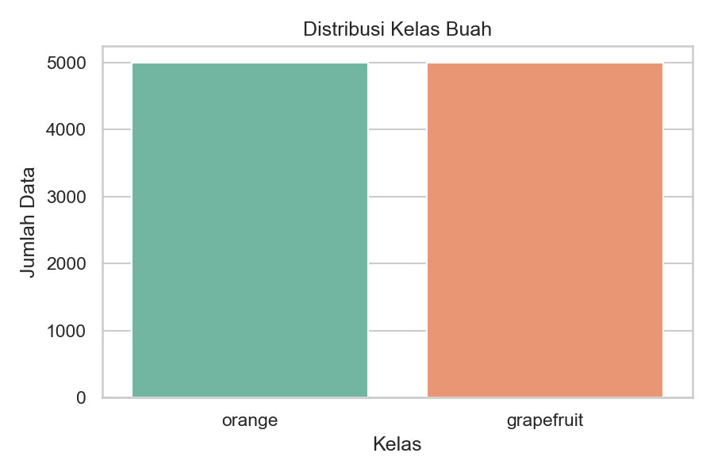
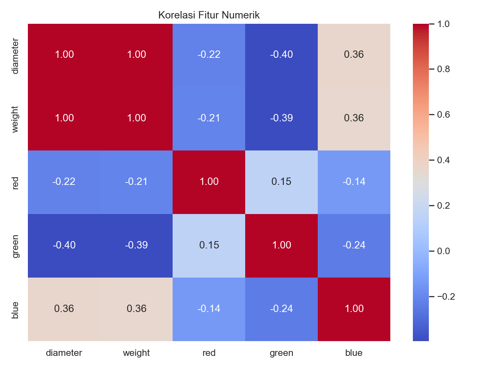
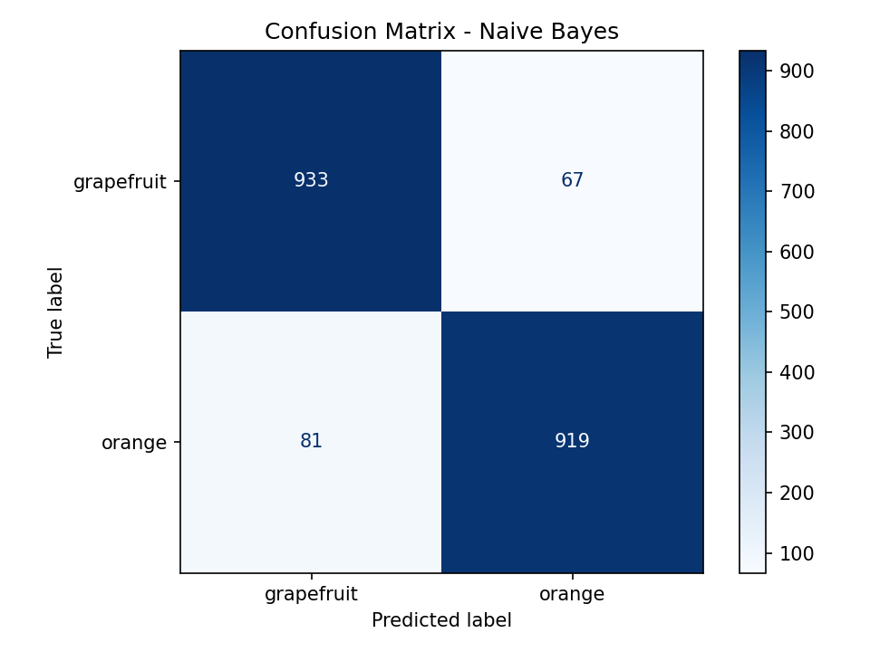
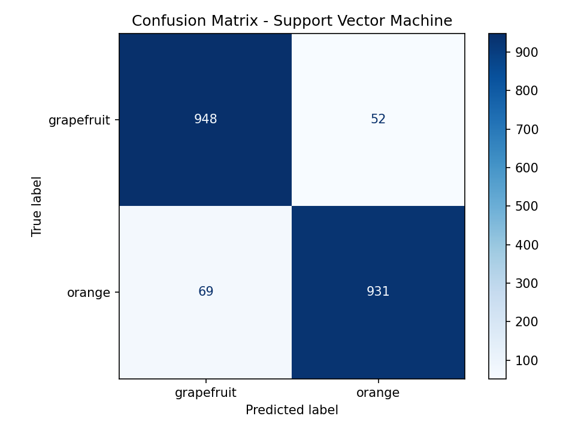
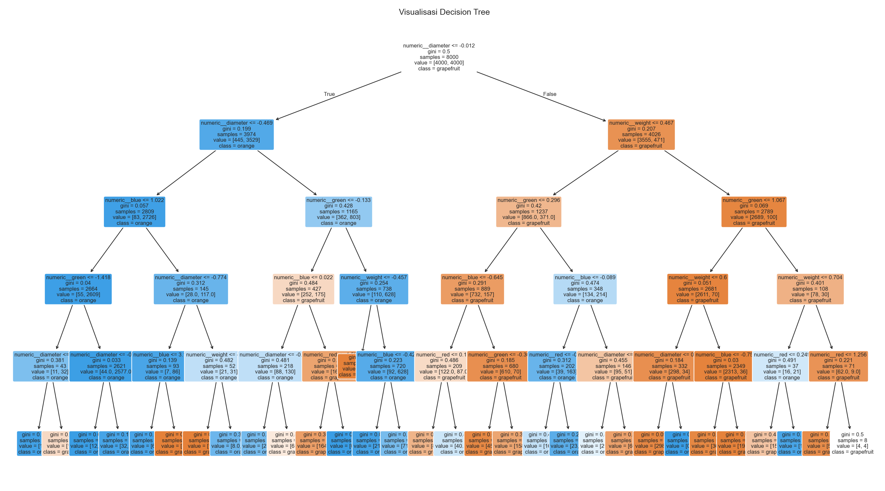

# Klasifikasi Jeruk dan Grapefruit

Project ini dibuat untuk menyelesaikan soal UTS machine learning: membuat model klasifikasi untuk membedakan buah `orange` dan `grapefruit` menggunakan dataset Kaggle `joshmcadams/oranges-vs-grapefruit`.

Model yang dibandingkan:

1. Decision Tree
2. Naive Bayes
3. Support Vector Machine

## Struktur File

```text
.
|-- data/
|   |-- oranges_vs_grapefruit.csv
|-- outputs/
|   |-- best_model.joblib
|   |-- classification_reports.md
|   |-- model_comparison.csv
|   |-- figures/
|   |   |-- class_distribution.png
|   |   |-- feature_correlation.png
|   |   |-- decision_tree.png
|   |   |-- confusion_matrix_decision_tree.png
|   |   |-- confusion_matrix_naive_bayes.png
|   |   |-- confusion_matrix_support_vector_machine.png
|   |-- models/
|       |-- decision_tree.joblib
|       |-- naive_bayes.joblib
|       |-- support_vector_machine.joblib
|-- download_dataset.py
|-- train_models.py
|-- predict.py
|-- requirements.txt
```

## 1. Membuat Virtual Environment

Langkah pertama adalah membuat virtual environment agar library project tidak bercampur dengan library Python lain di komputer.

```bash
python -m venv .venv
```

Setelah `.venv` dibuat, virtual environment di aktifkan.

## 2. Install Library

Setelah virtual environment aktif, library yang dibutuhkan di-install dari file `requirements.txt`.

```bash
pip install -r requirements.txt
```

Library utama yang dipakai:

- `pandas` untuk membaca dan mengolah dataset
- `scikit-learn` untuk preprocessing, training model, dan evaluasi
- `matplotlib` dan `seaborn` untuk visualisasi
- `joblib` untuk menyimpan model
- `kagglehub` untuk mengunduh dataset dari Kaggle

## 3. Download Dataset

Dataset diunduh menggunakan file `download_dataset.py`.

```bash
python download_dataset.py
```

Kode ini mengambil dataset:

```text
joshmcadams/oranges-vs-grapefruit
```

Setelah berhasil, file dataset disimpan ke:

```text
data/oranges_vs_grapefruit.csv
```

Dataset memiliki target pada kolom `name`, yaitu label buah:

- `orange`
- `grapefruit`

## 4. Tahapan Pembuatan Model

Tahapan utama dilakukan di file `train_models.py`.

### a. Membaca Dataset

Program membaca dataset CSV dari:

```text
data/oranges_vs_grapefruit.csv
```

Nama kolom juga dibersihkan agar konsisten, misalnya spasi diganti menjadi underscore dan semua huruf dibuat lowercase.

### b. Menentukan Fitur dan Target

Kolom target dicari secara otomatis dari kandidat:

```python
("name", "class", "label", "fruit")
```

Pada dataset ini, target yang digunakan adalah:

```text
name
```

Fitur `X` adalah semua kolom selain `name`, sedangkan target `y` adalah isi dari kolom `name`.

### c. Split Data Training dan Testing

Dataset dibagi menjadi data training dan testing menggunakan:

```python
train_test_split(test_size=0.2, random_state=42, stratify=y)
```

Hasil pembagian data:

| Jenis Data | Jumlah |
|---|---:|
| Training | 8000 |
| Testing | 2000 |

Data dibagi secara `stratify`, sehingga perbandingan kelas `orange` dan `grapefruit` tetap seimbang di data training dan testing.

### d. Preprocessing Data

Preprocessing dilakukan menggunakan `ColumnTransformer`.

Untuk fitur numerik:

1. Missing value diisi dengan median.
2. Data dinormalisasi menggunakan `StandardScaler`.

Untuk fitur kategorikal:

1. Missing value diisi dengan nilai yang paling sering muncul.
2. Data diubah menjadi numerik menggunakan `OneHotEncoder`.

Preprocessing dimasukkan ke dalam `Pipeline`, sehingga setiap model menerima proses preprocessing yang sama.

### e. Training Tiga Model

Tiga model yang dilatih:

```python
models = {
    "Decision Tree": DecisionTreeClassifier(
        criterion="gini",
        max_depth=5,
        random_state=42,
    ),
    "Naive Bayes": GaussianNB(),
    "Support Vector Machine": SVC(
        kernel="rbf",
        C=1.0,
        gamma="scale",
        random_state=42,
    ),
}
```

Setiap model dilatih menggunakan data training, lalu diuji menggunakan data testing.

## 5. Evaluasi Model

Evaluasi dilakukan menggunakan:

- Accuracy
- Precision
- Recall
- F1-score
- Confusion matrix

Hasil evaluasi disimpan ke:

```text
outputs/classification_reports.md
outputs/model_comparison.csv
```

Visualisasi disimpan ke folder:

```text
outputs/figures/
```

## 6. Hasil Perbandingan Model

Berdasarkan output `model_comparison.csv`, hasil perbandingan akurasi adalah:

| Model | Accuracy | Train Rows | Test Rows |
|---|---:|---:|---:|
| Support Vector Machine | 0.9395 | 8000 | 2000 |
| Naive Bayes | 0.9260 | 8000 | 2000 |
| Decision Tree | 0.9210 | 8000 | 2000 |

Model dengan akurasi tertinggi adalah:

```text
Support Vector Machine
```

dengan akurasi:

```text
0.9395 atau 93.95%
```

## 7. Visualisasi dan Penjelasan Angka

### Distribusi Kelas



Grafik ini menunjukkan jumlah data untuk setiap kelas buah.

| Class | Jumlah Data | Persentase |
|---|---:|---:|
| orange | 5000 | 50% |
| grapefruit | 5000 | 50% |

Total dataset adalah `10000` data. Karena jumlah `orange` dan `grapefruit` sama, dataset ini seimbang. Hal ini membantu model agar tidak berat sebelah ke salah satu kelas.

### Korelasi Fitur Numerik



Grafik ini menunjukkan hubungan antar fitur numerik. Nilai korelasi berada dari `-1` sampai `1`.

| Nilai Korelasi | Arti |
|---:|---|
| Mendekati 1 | Hubungan positif kuat |
| Mendekati -1 | Hubungan negatif kuat |
| Mendekati 0 | Hubungan lemah |

Beberapa angka penting:

| Fitur | Korelasi | Penjelasan |
|---|---:|---|
| diameter dan weight | 0.999 | Sangat kuat, buah yang diameternya besar hampir selalu lebih berat. |
| diameter dan green | -0.397 | Hubungan negatif sedang, semakin besar diameter, nilai green cenderung turun. |
| weight dan green | -0.392 | Hubungan negatif sedang, semakin berat buah, nilai green cenderung turun. |
| diameter dan blue | 0.363 | Hubungan positif sedang, semakin besar diameter, nilai blue cenderung naik. |
| red dan green | 0.149 | Hubungan lemah. |

Korelasi `diameter` dan `weight` yang sangat tinggi menunjukkan kedua fitur tersebut membawa informasi yang mirip.

### Confusion Matrix Decision Tree


Urutan label pada confusion matrix adalah `grapefruit`, lalu `orange`.

| Hasil | Jumlah |
|---|---:|
| grapefruit benar diprediksi grapefruit | 936 |
| grapefruit salah diprediksi orange | 64 |
| orange salah diprediksi grapefruit | 94 |
| orange benar diprediksi orange | 906 |

Total prediksi benar:

```text
936 + 906 = 1842
```

Total prediksi salah:

```text
64 + 94 = 158
```

Akurasi:

```text
1842 / 2000 = 0.9210 atau 92.10%
```

### Confusion Matrix Naive Bayes



| Hasil | Jumlah |
|---|---:|
| grapefruit benar diprediksi grapefruit | 933 |
| grapefruit salah diprediksi orange | 67 |
| orange salah diprediksi grapefruit | 81 |
| orange benar diprediksi orange | 919 |

Total prediksi benar:

```text
933 + 919 = 1852
```

Total prediksi salah:

```text
67 + 81 = 148
```

Akurasi:

```text
1852 / 2000 = 0.9260 atau 92.60%
```

### Confusion Matrix Support Vector Machine



| Hasil | Jumlah |
|---|---:|
| grapefruit benar diprediksi grapefruit | 948 |
| grapefruit salah diprediksi orange | 52 |
| orange salah diprediksi grapefruit | 69 |
| orange benar diprediksi orange | 931 |

Total prediksi benar:

```text
948 + 931 = 1879
```

Total prediksi salah:

```text
52 + 69 = 121
```

Akurasi:

```text
1879 / 2000 = 0.9395 atau 93.95%
```

SVM menjadi model terbaik karena memiliki prediksi benar paling banyak, yaitu `1879` dari `2000` data test, dan kesalahan paling sedikit, yaitu `121` data.

### Visualisasi Decision Tree



Gambar ini menunjukkan aturan keputusan yang dibuat oleh model Decision Tree. Setiap node berisi kondisi pemisahan data, misalnya berdasarkan fitur ukuran atau warna. Karena `max_depth=5`, pohon dibatasi sampai kedalaman 5 agar tidak terlalu kompleks.

## 8. Detail Classification Report

### Decision Tree

Decision Tree menghasilkan akurasi:

```text
0.9210 atau 92.10%
```

Ringkasan performa:

| Class | Precision | Recall | F1-score | Support |
|---|---:|---:|---:|---:|
| grapefruit | 0.91 | 0.94 | 0.92 | 1000 |
| orange | 0.93 | 0.91 | 0.92 | 1000 |

Model ini cukup baik, tetapi masih lebih rendah dibanding Naive Bayes dan SVM. Decision Tree mudah dipahami karena alur keputusannya dapat divisualisasikan pada file:

```text
outputs/figures/decision_tree.png
```

### Naive Bayes

Naive Bayes menghasilkan akurasi:

```text
0.9260 atau 92.60%
```

Ringkasan performa:

| Class | Precision | Recall | F1-score | Support |
|---|---:|---:|---:|---:|
| grapefruit | 0.92 | 0.93 | 0.93 | 1000 |
| orange | 0.93 | 0.92 | 0.93 | 1000 |

Naive Bayes memiliki hasil sedikit lebih baik daripada Decision Tree. Model ini sederhana dan cepat, tetapi memiliki asumsi bahwa fitur-fitur relatif independen.

### Support Vector Machine

Support Vector Machine menghasilkan akurasi:

```text
0.9395 atau 93.95%
```

Ringkasan performa:

| Class | Precision | Recall | F1-score | Support |
|---|---:|---:|---:|---:|
| grapefruit | 0.93 | 0.95 | 0.94 | 1000 |
| orange | 0.95 | 0.93 | 0.94 | 1000 |

SVM menjadi model terbaik pada percobaan ini. Kernel `rbf` membantu model membentuk batas klasifikasi yang lebih fleksibel dibanding pemisahan linear sederhana.

## 9. Output yang Dihasilkan

Setelah menjalankan:

```bash
python train_models.py
```

program menghasilkan beberapa output:

| Output | Keterangan |
|---|---|
| `outputs/model_comparison.csv` | Tabel perbandingan akurasi ketiga model |
| `outputs/classification_reports.md` | Classification report lengkap |
| `outputs/best_model.joblib` | Model terbaik berdasarkan akurasi |
| `outputs/models/decision_tree.joblib` | Model Decision Tree |
| `outputs/models/naive_bayes.joblib` | Model Naive Bayes |
| `outputs/models/support_vector_machine.joblib` | Model SVM |
| `outputs/figures/class_distribution.png` | Grafik distribusi kelas |
| `outputs/figures/feature_correlation.png` | Grafik korelasi fitur numerik |
| `outputs/figures/decision_tree.png` | Visualisasi struktur Decision Tree |
| `outputs/figures/confusion_matrix_*.png` | Confusion matrix setiap model |

## 10. Prediksi Data Baru

File `predict.py` digunakan untuk melakukan prediksi pada data baru menggunakan model terbaik.

Contoh perintah:

```bash
python predict.py --input data_baru.csv
```

Secara default, model yang digunakan adalah:

```text
outputs/best_model.joblib
```

File input harus berisi kolom fitur yang sama dengan dataset training, tetapi tanpa kolom target `name`.

## 11. Kesimpulan

Berdasarkan hasil evaluasi, ketiga model mampu melakukan klasifikasi buah `orange` dan `grapefruit` dengan akurasi di atas 92%.

Urutan performa model dari terbaik ke terendah:

1. Support Vector Machine: 93.95%
2. Naive Bayes: 92.60%
3. Decision Tree: 92.10%

Model terbaik adalah **Support Vector Machine** karena memiliki akurasi paling tinggi serta nilai precision, recall, dan f1-score yang stabil pada kedua kelas.
